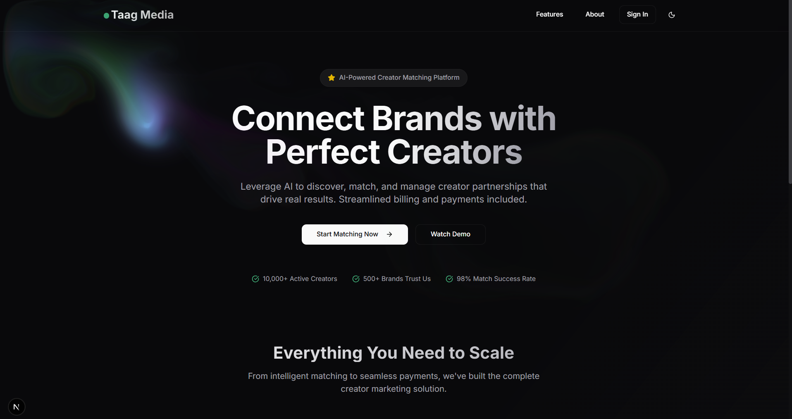

# Taag Media: Full-Stack "Match & Bill" Platform

This repository contains the complete full-stack solution for the internship assignment from **Taag Media**. The project, themed "Match & Bill," is a fully-featured platform designed to connect brands with creators and streamline the billing process. It was built from the ground up, incorporating a modern tech stack and focusing on a professional, clean user experience.

---

## 🚀 Project Demo

The video below demonstrates the complete user flow, from the interactive landing page and authentication to submitting a brand brief, viewing AI-matched creators, and completing the multi-step billing process with a final PDF preview.

[](./demo.mp4)

> **Note:** To view the demo, click the image above. You may need to download the `demo.mp4` file from the repository if your browser doesn't play it directly. *(**Instructions for you:** Take an exciting screenshot of your application, save it as `demo_preview.png` in this root directory, and the link above will work automatically.)*

---

## ✨ Core Features

### Full-Stack & General
- **Full User Authentication:** Secure sign-up, sign-in, and "Continue with Google" OAuth powered by Supabase.
- **Protected Routes:** The main dashboard is only accessible to authenticated users.
- **Dark/Light Mode:** A sleek, modern UI with a theme toggle for user preference.
- **Professional UI/UX:** A clean, app-like interface with a collapsible sidebar, tooltips, and a focus on a smooth user experience.
- **Extra Polish:** Includes a dynamic "Splash Cursor" effect on the landing page for a memorable first impression.

### Frontend (Next.js)
- **Interactive Brand Brief Form:** A comprehensive form with robust client-side validation using `Zod` and `react-hook-form`.
- **Dynamic Match Console:** Displays a ranked list of creators fetched live from the backend, complete with match scores, progress bars, and reason badges.
- **Multi-Step Billing Flow:** A guided, two-step process to capture brand and creator financial details.
- **Advanced PDF Generation:** Generates a clean, professional PDF summary of billing details with a live preview in a modal, powered by `@react-pdf/renderer`.
- **Component-Based & Typed:** Built with TypeScript and Shadcn/ui for a fully-typed, maintainable, and beautiful component library.

### Backend (FastAPI)
- **Weighted Creator Matching Algorithm:** A sophisticated scoring engine that ranks creators based on relevance (40%), audience fit (30%), performance/price (20%), and constraints (10%).
- **Diversification Logic:** Prevents a single creator vertical from dominating the top recommendations.
- **Secure Server-Side Validation:** Ensures the integrity of critical financial identifiers like GSTIN, PAN, and IFSC codes.
-   **Automated API Documentation**: Interactive API docs are automatically generated by FastAPI (Swagger UI).

---

## 🛠️ Tech Stack

| Frontend                                                                                                                                                                                                                                                   | Backend                                                                                                                                                                 |
| ---------------------------------------------------------------------------------------------------------------------------------------------------------------------------------------------------------------------------------------------------------- | ----------------------------------------------------------------------------------------------------------------------------------------------------------------------- |
|                                                      |   |
|                         |   |
|                                                       |                                                                                |
|                                                  |                                                                                                                                                                         |

---

## ⚙️ Getting Started

### Prerequisites

-   Node.js (v18 or newer)
-   Python (v3.9 or newer)
-   A Supabase account for authentication.

### Local Setup

1.  **Clone the repository:**
    ```bash
    git clone <your-repo-url>
    cd TAAG_Media
    ```

2.  **Setup the Backend:**
    ```bash
    cd backend

    # Create and activate a virtual environment
    python -m venv venv
    source venv/bin/activate  # On Windows, use `venv\Scripts\activate`

    # Install dependencies
    pip install -r requirements.txt

    # Seed the database with sample data
    python -m app.seed
    ```

3.  **Setup the Frontend:**
    - You will need your **Supabase Project URL** and **Anon Key**. Find them in your Supabase project under `Settings > API`.
    - You will also need to set up **Google OAuth** credentials from the Google Cloud Console.
    ```bash
    cd ../frontend

    # Install dependencies
    npm install

    # Create the environment file
    cp .env.local.example .env.local
    ```
    - Now, open the newly created `.env.local` file and add your Supabase and Google credentials.

4.  **Run the Application:**
    - **Terminal 1 (for Backend):**
        ```bash
        cd backend
        source venv/bin/activate
        uvicorn app.main:app --reload
        ```
        > The backend will be running at `http://127.0.0.1:8000`

    - **Terminal 2 (for Frontend):**
        ```bash
        cd frontend
        npm run dev
        ```
        > The frontend will be live at `http://localhost:3000`

### How to Use

1.  Visit `http://localhost:3000` to see the landing page.
2.  Click "Get Started" or "Login".
3.  Sign up or sign in using email or the Google provider.
4.  You will be automatically redirected to the protected dashboard.
5.  Use the sidebar to navigate between the **Brand Brief**, **Match Console**, and **Billing** sections.
6.  Fill out the Brand Brief form and click "Find Creators" to see the live API in action.
7.  Complete the multi-step billing flow to generate a downloadable PDF summary.

---

Thank you for the opportunity to work on this assignment!